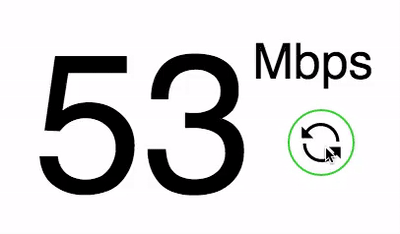

# fast

Javascript reproduction of Netflix's Fast.com functionality to determine your network's download speed

## Usage

First, include `fast.js` in your project.

```js
var fast = new Fast(doneFunction, updateFunction);
```

`doneFunction` will fire when the speed test is complete

`updateFuncion` will fire on speed test updates and returns a variable `rate`, which is your network's speed in megabits/sec

## Example

To try out the functionality, open `index.html` (in a server setting)

NOTE: The server must run at port 8000 because it seems to be the only port that is whitelisted for CORS



## Acknowledgements

All credit to Netflix for their amazing eff you to internet service providers who like to throttle network speeds indiscriminately
